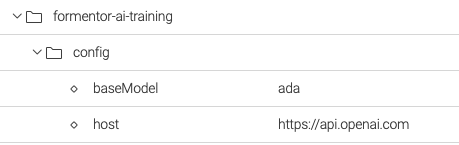
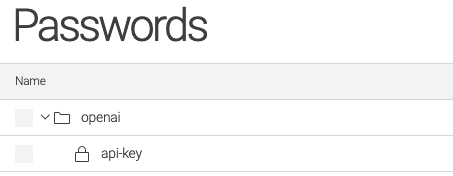
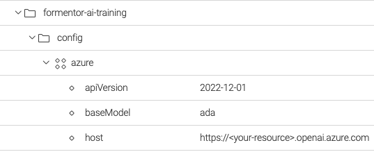
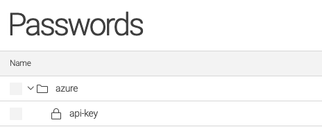

# Magnolia AI Training

This module of [Magnolia CMS](https://www.magnolia-cms.com/) provides a tool to _fine-tune_ [Large language models](https://en.wikipedia.org/wiki/Large_language_model) like [GPT](https://en.wikipedia.org/wiki/GPT-3) using as input dataset contents in [Magnolia CMS](https://www.magnolia-cms.com/).

## Features
- Integration with the API of [OpenAI](https://platform.openai.com/docs/api-reference) and [Azure OpenAI](https://learn.microsoft.com/en-us/azure/ai-services/openai/reference)
- Export of contents in Magnolia to datasets for fine-tuning models of [Open AI](https://platform.openai.com/) and [Azure OpenAI](https://learn.microsoft.com/en-us/azure/ai-services/openai)

## Setup
1. Add maven dependency to your bundle of Magnolia
```xml
<dependencies>
    <dependency>
        <groupId>org.formentor</groupId>
        <artifactId>magnolia-ai-training</artifactId>
        <version>0.0.1</version>
    </dependency>
</dependencies>
```

2. Activate and configure [Open AI](https://openai.com/) or [Azure OpenAI](https://azure.microsoft.com/products/cognitive-services/openai-service/)

#### OpenAI
- Specify _host_ of OpenAI and _model_ to fine-tuned in the configuration of the module.

`config:/formentor-ai-training/openAI`



- Specify `API key` in the secret `openai/api-key` of [Password Manager](https://docs.magnolia-cms.com/product-docs/6.2/Modules/List-of-modules/Password-Manager-module.html).


#### Azure OpenAI
- Specify `apiVersion` and `url` of the Azure resource and the model to be fine-tuned in configuration of the module.

`config:/formentor-ai-training/azure`



- Specify the `API key` in the secret `azure/api-key` of [Password Manager](https://docs.magnolia-cms.com/product-docs/6.2/Modules/List-of-modules/Password-Manager-module.html).



## Usage
The module _ai-training_ provides the command `ModelTrainerCommand` to create fine-tuned models

Input parameters of `ModelTrainerCommand`
- **modelName** to specify the prefix of the fine-tuned model created.
- **workspace** to specify the workspace of the text contents to be used to build the training data for fine-tuning.
- **root** to specify the root path of the nodes to be used to build the examples of the datataset.
- **nodeType** to specify of the node type of the nodes to be used to build the training data.
- **propertiesAsPrompt** to specify the properties to be used to build the *prompt* in the training data.
  In case of `linked fields` specify the `target worspace` and `target property`
- **propertyAsCompletion** to specify the property used as *completion* in the examples of the training data.

### Example
```groovy
cm = info.magnolia.commands.CommandsManager.getInstance()
command = cm.getCommand('formentor','FineTuneModelCommand')

/**
 *
 * This example fine-tunes the model using as dataset:
 * INPUT: properties "tourTypes", "category" and "displayName" of nodtypes "mgnl:content" in the workspace "tours" from path "/magnolia-travels" 
 * COMPLETION: property "body"
 *
 * The fine-tuned model will be trained for the task of writing description of tours from the factsheet
 */
propertyPromptTourTypes = new com.formentor.magnolia.ai.training.domain.PropertyPromptValue()
propertyPromptTourTypes.setPropertyName('tourTypes')
reference = new com.formentor.magnolia.ai.training.domain.PropertyPromptValue.Reference()
reference.setTargetWorkspace("category")
reference.setTargetPropertyName("displayName")
propertyPromptTourTypes.setReference(reference)

propertyPromptLocation = new com.formentor.magnolia.ai.training.domain.PropertyPromptValue()
propertyPromptLocation.setPropertyName('location')

command.setWorkspace('tours')
command.setModelName('magnolia-tours')
command.setRoot('/magnolia-travels')
command.setNodeType('mgnl:content')
command.setPropertiesAsPrompt([propertyPromptTourTypes, propertyPromptLocation])
command.setPropertyAsCompletion(['body'])

command.execute(new info.magnolia.context.SimpleContext())
```